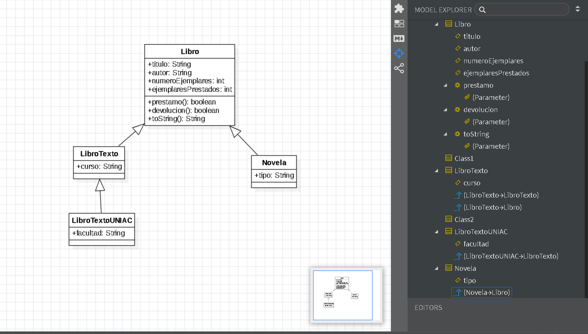

# Sistema de Biblioteca - Programación II

## Autor
Juan Sebastián González Montenegro

## Descripción
Este proyecto implementa un sistema de biblioteca utilizando Programación Orientada a Objetos en Java.

Se modelan diferentes tipos de libros utilizando herencia.

Clases implementadas:

- Libro
- LibroTexto
- LibroTextoUNIAC
- Novela
- Main

## Estructura del proyecto

Proyecto desarrollado utilizando estructura Maven:

src/main/java/com/biblioteca

## Ejecución

Para compilar y ejecutar:

javac *.java
java com.biblioteca.Main

## Diagrama UML

